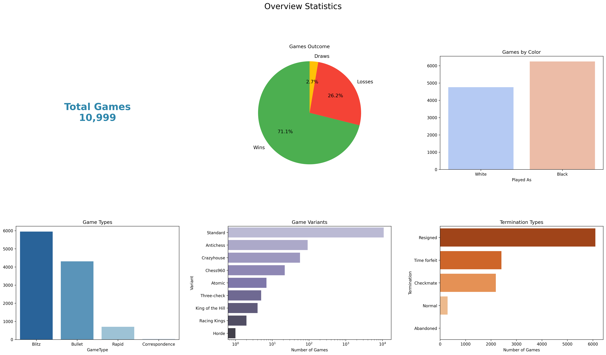
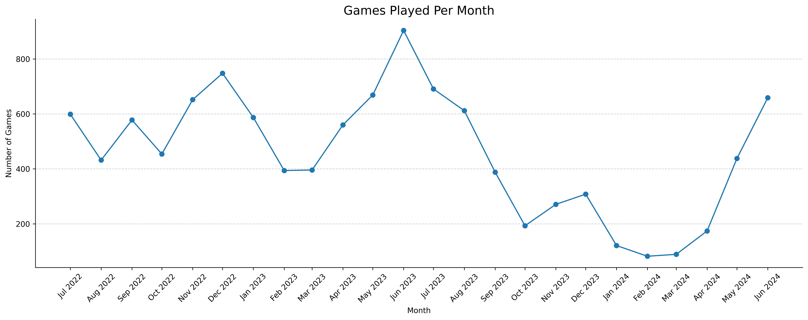
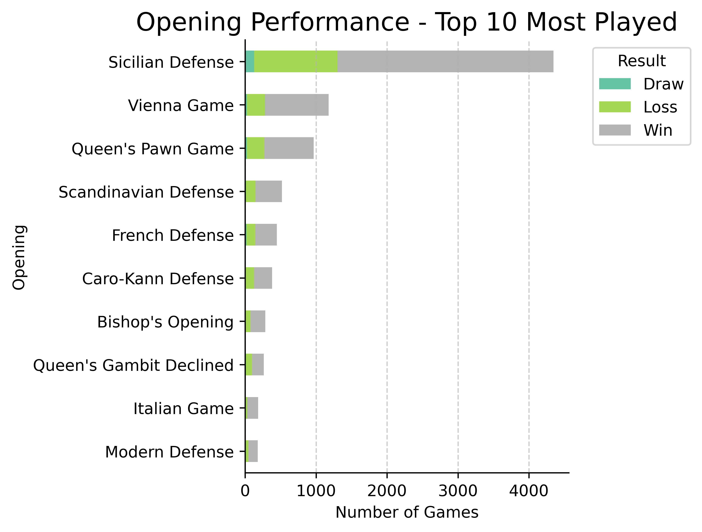
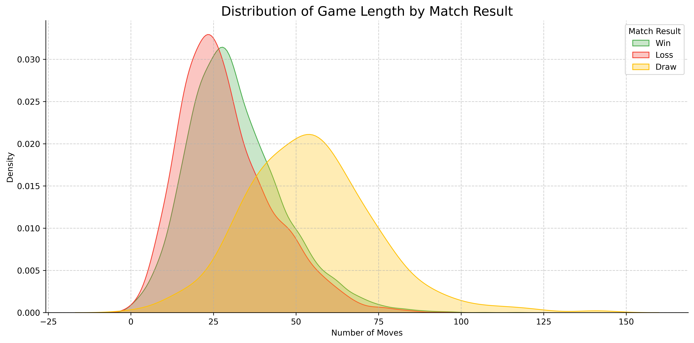
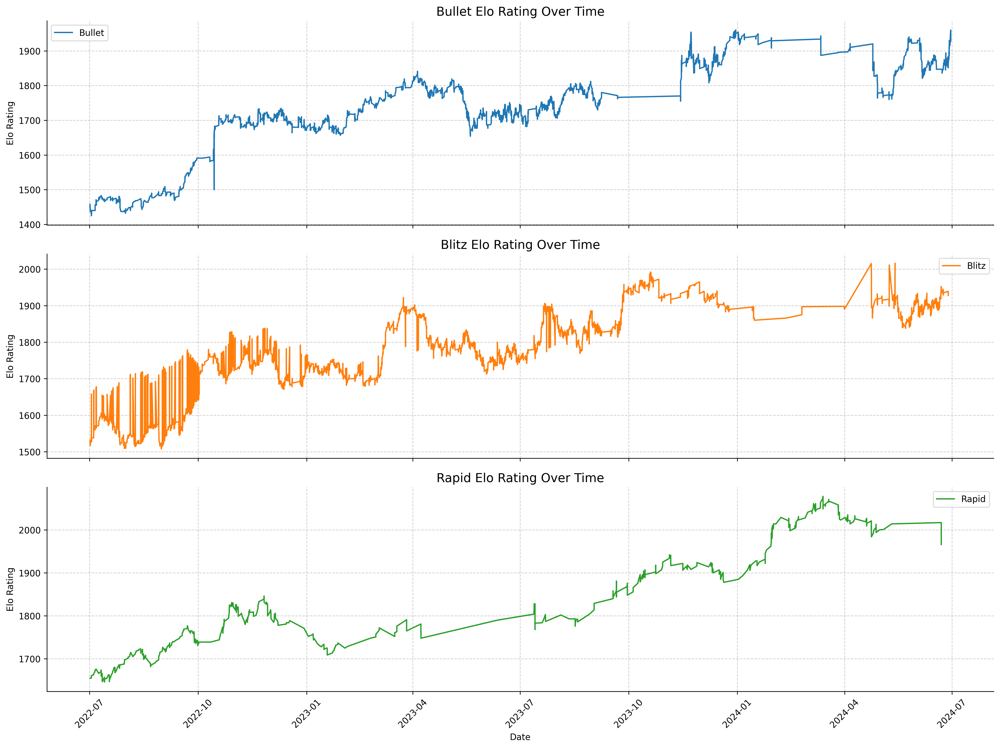

# ♟️ Chess Game Data Analysis

## 📌 Overview
This project presents an end-to-end data analysis of my chess games spanning **two years** (July 2022 – June 2024) on the platform **Lichess**. The goal was to extract meaningful patterns from the game data, understand my playing habits, and draw insights from visualizations.

## 🛠️ Tools & Libraries
- Python
- pandas, numpy
- matplotlib, seaborn
- python-chess
- scikit-learn, LogisticRegression
- Jupyter Notebook

## 📂 Data Source  
- The dataset consists of **2 years of personal game history** (July 2022 – June 2024) exported from [Lichess](https://lichess.org) in `.pgn` format.  
- I used the **`python-chess` (`chess.pgn`)** package to parse and convert the `.pgn` data into a structured format.  
- Game metadata, move sequences, player ratings, time controls, results, and other features were extracted and saved in an **Excel file** using `pandas` for further analysis and visualization.

---

## 📊 Exploratory Data Analysis

### 1. Game Distribution by Variant and Time Control
> Over two years, I primarily played **Blitz** and **Bullet**, with a strong focus on **Standard** variant games.

---

### 2. Monthly Game Count
> Clear spikes in activity were seen in months like **June and December**, aligning with periods of increased availability (semester break).

---

### 3. Performance by Opening
> Openings such as the **Sicilian Defense** and **Vienna Opening** consistently delivered **higher win rates**, making them reliable choices in competitive play.

---

### 4. Distribution of game length by results
> A significant proportion of both wins and losses occurred in shorter games (under **30 moves**), indicating that critical blunders often happen in the early phase of the game — either by me or my opponent.

> In contrast, longer games (**50+ moves**) more frequently resulted in draws, likely due to extensive piece exchanges leading to balanced endgame positions.

---

### 5. Elo Rating Progression
> A consistent upward trend in rating across all time formats reflects steady progress. The data confirms that focused practice and frequent play lead to measurable performance gains.

---

## 🤖 Predictive Modeling

Developed a machine learning model to predict game outcomes (`Win`, `Loss`, `Draw`) based on pre-game metadata.

### 🔍 Features Used:
- Elo ratings
- Rating difference
- Opening played
- Time control
- Variant
- Castling behavior
- Game length (moves/turns)

### 📈 Model Performance:
- **Model**: `Logistic Regressor`
- **Accuracy Achieved**: `0.71`

> The model highlighted **rating difference**, **opening choice**, and **time control** as the most influential predictors of game result.

---

## 💡 Key Insights

- **Playing against stronger opponent** resulted in high win percentage and signifies the consistent growth over time.
- **Familiar openings consistently drive better performance** — practicing a focused opening repertoire is key.
- **Evening hours** tend to produce more wins, suggesting peak focus and better form.

---

## 🚀 Future Enhancements
- Add blunder/inaccuracy analysis using `Stockfish` evaluations
- Build a `PowerBI` dashboard for real-time filtering and visualization
- Extend the predictive model to include move-level features and use other classifications models.

---

## 📁 Project Files
- 📓 [Data Extraction](chess_pgn_data_extraction.ipynb)
- 📓 [Data Analysis](data_analysis.ipynb)

---

## 📬 Let’s Connect
If you're a chess enthusiast, data analyst, or both — feel free to reach out or explore my other projects!

> [LinkedIn](https://linkedin.com/in/nishiv-singh) | [GitHub](https://github.com/NishivSingh)

